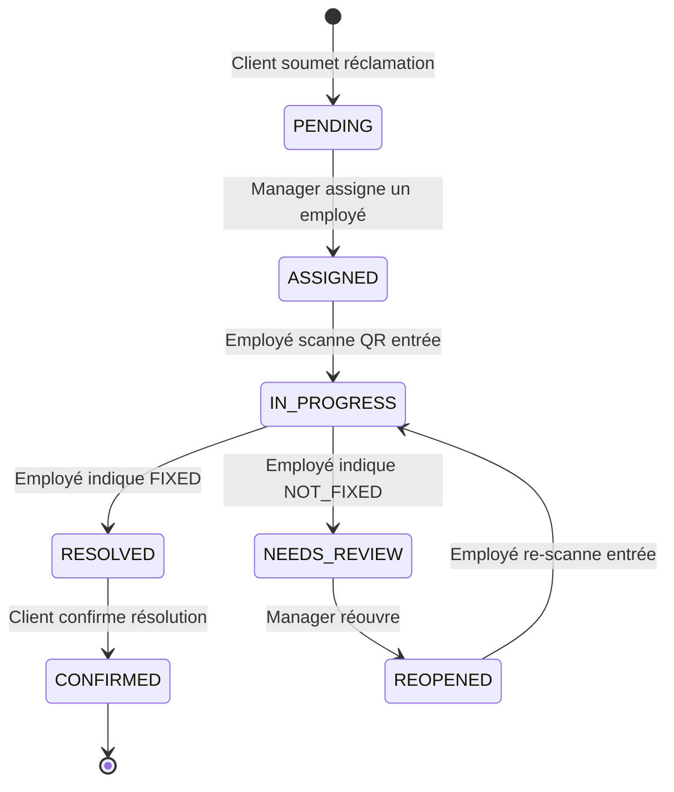

# 📋 Scénario de Test Manuel — End-to-End

> Ce document décrit le scénario complet de test de bout en bout du système **Hotel Smart Concierge**, depuis le démarrage des services jusqu'à la confirmation finale par le client.
> Inclut : check-in sécurisé par QR token, messagerie temps réel (Socket.IO), traduction NLLB, convertisseur devises API externe, événements hôtel.

---

## Prérequis

| Composant | Technologie | Port |
|---|---|---|
| **PostgreSQL** | Base de données | `5432` |
| **ai-service** | FastAPI (Python) + NLLB | `8000` |
| **backend** | Express.js + Socket.IO | `5000` |
| **web-app** | Vite + React | `5173` |
| **worker-app** | Flutter (Android/iOS) | — |

### Comptes de test (seed)

Mot de passe par défaut pour tous les comptes : **`Password123!`**

| Rôle | Email | Rôle système |
|---|---|---|
| Admin | `admin@hotel.test` | `ADMIN` |
| Réceptionniste | `reception@hotel.test` | `RECEPTIONIST` |
| Chef Maintenance | `maintenance.manager@hotel.test` | `MAINTENANCE_MANAGER` |
| Chef Gouvernante | `housekeeping.manager@hotel.test` | `HOUSEKEEPING_MANAGER` |
| Ouvrier Maintenance 1 | `maintenance.worker1@hotel.test` | `EMPLOYEE` |
| Ouvrier Maintenance 2 | `maintenance.worker2@hotel.test` | `EMPLOYEE` |
| Gouvernante 1 | `housekeeping.worker1@hotel.test` | `EMPLOYEE` |
| Gouvernante 2 | `housekeeping.worker2@hotel.test` | `EMPLOYEE` |

### Réservations de test (seed)

> [!IMPORTANT]
> Les dates des réservations sont **relatives au jour d'exécution du seed**.
> Si le test est lancé plusieurs jours après le seed, les réservations seront dans le passé.
> **Avant chaque session de test**, re-seeder la base de données (voir Étape 2).

| N° Réservation | Client | Chambre | Statut | Dates (relatives) |
|---|---|---|---|---|
| `RES-2026-001` | Jean Dupont | 101 | `CHECKED_IN` | aujourd'hui → +3 jours |
| `RES-2026-002` | Sarah Johnson | 203 | `CHECKED_IN` | aujourd'hui → +5 jours |
| `RES-2026-003` | Ahmed Ben Ali | 201 | `PENDING` | +1 jour → +4 jours |
| `RES-2026-004` | Maria Garcia | 301 | `PENDING` | +2 jours → +6 jours |
| `RES-2026-005` | Marco Rossi | 102 | `CHECKED_OUT` | -2 jours → -1 jour |

---

## Étape 1 — Démarrer ai-service (NLLB)

```bash
cd ai-service
.\venv\Scripts\Activate.ps1
uvicorn app.main:app --host 0.0.0.0 --port 8000 --reload
```

**Résultat attendu :**
- Le service démarre sur `http://127.0.0.1:8000`.
- `GET /health` retourne :
  ```json
  { "status": "ok", "classifier_loaded": true, "translation_model": "facebook/nllb-200-distilled-600M", "translation_model_loaded": false }
  ```
- Le modèle NLLB n'est **pas encore chargé** (lazy loading au premier appel).
- `GET /supported-languages` retourne la liste des 80+ langues supportées.

**Vérification rapide :**
```bash
curl http://localhost:8000/health
curl http://localhost:8000/supported-languages
```

---

## Étape 2 — Démarrer backend

### 2a — Initialiser / rafraîchir la base de données

> [!IMPORTANT]
> **Obligatoire avant chaque session de test** pour obtenir des dates de réservation fraîches.

```bash
cd backend
npx prisma db push --force-reset
npx prisma db seed
```

> Si c'est la toute première exécution :
> ```bash
> npx prisma migrate dev
> npx prisma db seed
> ```

### 2b — Démarrer le serveur

```bash
npm run dev
```

**Résultat attendu :**
- Le serveur Express démarre sur `http://localhost:5000`.
- Les logs affichent :
  ```
  Backend running on port 5000
  Socket.IO: enabled
  ```
- Socket.IO est initialisé sur le même serveur HTTP.

---

## Étape 3 — Démarrer web-app

```bash
cd web-app
npm run dev
```

**Résultat attendu :**
- L'application Vite démarre sur `http://localhost:5173`.
- La page d'accueil publique s'affiche.

---

## Étape 4 — Démarrer worker-app Flutter

```bash
cd worker-app
flutter run -d <DEVICE_ID>
```

> Pour lister les devices connectés : `flutter devices`
>
> **Prérequis environnement :**
> - `JAVA_HOME` → JDK valide
> - `ANDROID_HOME` → SDK Android
> - Si erreur mémoire Gradle : `android/gradle.properties` → `Xmx2G`

**Résultat attendu :**
- L'application se lance sur le device physique ou l'émulateur.
- L'écran de login s'affiche.

---

## Étape 5 — Se connecter comme réceptionniste

1. Ouvrir `http://localhost:5173/login`.
2. Saisir :
   - **Email :** `reception@hotel.test`
   - **Mot de passe :** `Password123!`
3. Cliquer **Se connecter**.

**Résultat attendu :**
- Redirection vers `/dashboard/reception`.
- La liste des réservations s'affiche.
- En bas de page, les onglets sont visibles : Réservations, Chambres, Voyageurs, Réclamations, QR, **Messages clients**, **Événements**.
- L'indicateur Socket.IO **🟢 en direct** apparaît dans l'onglet Messages (si la connexion WebSocket est établie).

---

## Étape 6 — Réceptionniste génère le QR Check-in sécurisé

1. Dans le dashboard réception, repérer la section **QR Check-in**.
2. Cliquer sur **🏨 Générer QR Check-in** (POST `/api/checkin-qr`).
3. Un URL sécurisé est généré : `http://localhost:5173/checkin?token=<JWT_24H>`.

**Résultat attendu :**
- Un QR code s'affiche avec l'URL contenant un token JWT (valable 24h).
- Le bouton **📋 Copier le lien** copie l'URL dans le presse-papiers.
- Le bouton **🔄 Regénérer (nouveau token)** permet de créer un nouveau token.

---

## Étape 7 — Client fait check-in via QR sécurisé

1. Scanner le QR code ou copier le lien de l'étape 6.
2. Ouvrir `http://localhost:5173/checkin?token=...` dans un **navigateur séparé** (simulant le client).
3. Saisir le numéro de réservation : `RES-2026-003`.
4. Cliquer **Rechercher**.
5. Vérifier les informations affichées (Ahmed Ben Ali, chambre 201).
6. Confirmer le check-in.

**Résultat attendu :**
- La page vérifie le token `X-Checkin-Token` avant tout appel API.
- Si le token est absent : 🔒 "Accès non autorisé" s'affiche.
- Si le token est expiré : "Le lien de check-in a expiré".
- Si le token est valide : le formulaire s'affiche normalement.
- Après confirmation : le statut passe de `PENDING` à `CHECKED_IN`.
- Retour au dashboard réception : la réservation affiche `CHECKED_IN`.

---

## Étape 8 — Réceptionniste génère le QR client chambre

1. Revenir au dashboard réception.
2. Sur la réservation `RES-2026-003` (maintenant `CHECKED_IN`), cliquer sur **Générer lien QR client**.
3. L'API appelle `POST /api/reservations/:id/client-room-link`.

**Résultat attendu :**
- Un lien est généré : `http://localhost:5173/room?token=<JWT_TOKEN>`.
- Le token expire à la date de check-out de la réservation.

---

## Étape 9 — Client ouvre /room?token=...

1. Copier le lien généré à l'étape 8.
2. Ouvrir ce lien dans le navigateur du client (incognito).

**Résultat attendu :**
- La page PWA chambre s'affiche (RoomHomePage).
- Le client voit les options :
  - 📝 **Envoyer une réclamation** (`/room/complaint`)
  - 📋 **Mes réclamations** (`/room/complaints`)
  - 💬 **Messages** (`/room/messages`)
  - ℹ️ **Infos hôtel** (`/room/hotel-info`)
  - 💱 **Convertisseur devises** (`/room/currency`)
  - 📅 **Événements** (`/room/events`)
- Le numéro de chambre (201) est affiché.

---

## Étape 10 — Client teste le convertisseur de devises (API externe)

1. Depuis la page chambre, cliquer sur **💱 Convertisseur devises**.
2. La page charge les taux depuis l'API ExchangeRate-API.

**Résultat attendu :**
- L'indicateur de source affiche **🟢 API live** (pas "fallback").
- Le tableau des taux populaires affiche ~12 devises (EUR, USD, GBP, CHF...).
- **166 devises** sont disponibles dans les selects.

3. Saisir :
   - **Montant :** `100`
   - **De :** `EUR`
   - **Vers :** `TND`
4. Cliquer **Convertir**.

**Résultat attendu :**
- Le résultat s'affiche (ex: `100 EUR = ~338.xxx TND`).
- Le taux de conversion est visible.
- Le bouton **⇄** permet d'inverser les devises.

5. Tester une conversion inverse (TND → EUR).

---

## Étape 11 — Client envoie une réclamation

1. Revenir à la page chambre, cliquer **Envoyer une réclamation**.
2. Rédiger un message en **espagnol** :
   > « El aire acondicionado no funciona en mi habitación. Hace mucho calor. »
3. Soumettre la réclamation.

**Résultat attendu :**
- Message de confirmation affiché au client.
- La réclamation est créée en base avec le statut `PENDING`.

---

## Étape 12 — IA détecte / traduit / classifie (NLLB)

Le backend appelle automatiquement `POST /ai-service/analyze` :

1. **Détection de langue** → `es` (espagnol), confidence ~0.99.
2. **Traduction vers EN** (NLLB) → `"The air conditioning is not working in my room. It is very hot."`
3. **Classification** → `MAINTENANCE`.
4. **Traduction vers FR** (NLLB) → `"La climatisation ne fonctionne pas dans ma chambre. Il fait très chaud."`
5. **Glossaire hôtelier** appliqué en post-traitement.

**Résultat attendu :**
- `detectedLanguage` = `es`
- `staffMessage` = message traduit en français par NLLB (pas de mock)
- `category` = `MAINTENANCE`
- `translation_model` = `facebook/nllb-200-distilled-600M`
- Le statut reste `PENDING`.

> [!NOTE]
> Le **premier appel** de traduction prend ~30-60 secondes (chargement du modèle NLLB en mémoire).
> Les appels suivants sont quasi-instantanés grâce au cache LRU.

---

## Étape 13 — Client envoie un message à la réception (temps réel)

1. Depuis la page chambre, cliquer **💬 Messages**.
2. L'indicateur **🟢 en direct** confirme la connexion Socket.IO.
3. Taper un message en espagnol :
   > « Necesito más toallas por favor »
4. Cliquer **➤** pour envoyer.

**Résultat attendu :**
- Le message est envoyé via **WebSocket** (pas REST).
- Le message apparaît instantanément dans la bulle client (bleu).
- L'IA traduit automatiquement le message en français pour la réception.

---

## Étape 14 — Réception reçoit le message en temps réel

1. Revenir au dashboard réception, onglet **Messages clients**.
2. L'indicateur **🟢 en direct** confirme le Socket.IO côté staff.
3. La conversation avec la chambre 201 apparaît dans la liste.

**Résultat attendu :**
- La conversation apparaît **sans rafraîchir la page** (temps réel via Socket.IO).
- Le compteur de messages non lus est visible.
- Ouvrir la conversation : le `staffMessage` (traduit en français) s'affiche.

4. Répondre en français :
   > « Des serviettes supplémentaires seront apportées dans 10 minutes. »
5. Envoyer.

**Résultat attendu :**
- Le message est envoyé via **WebSocket** (event `staff:reply_guest`).
- Côté client (PWA) : le message apparaît **instantanément** dans la bulle réception (gris), traduit dans la langue du client (espagnol).

---

## Étape 15 — Chef de maintenance voit la réclamation

1. Se déconnecter du compte réceptionniste.
2. Se connecter avec **`maintenance.manager@hotel.test`** / `Password123!`.
3. Accéder au dashboard manager (`/dashboard/manager`).
4. La réclamation créée à l'étape 11 apparaît, catégorisée `MAINTENANCE`.

**Résultat attendu :**
- La réclamation est visible avec :
  - Chambre 201
  - Catégorie `MAINTENANCE`
  - Message traduit en français (par NLLB)
  - Statut `PENDING`

---

## Étape 16 — Responsable assigne la tâche

1. Ouvrir la réclamation.
2. Sélectionner **Maintenance Worker 1** comme employé assigné.
3. Confirmer l'assignation.

**Résultat attendu :**
- Le statut passe de `PENDING` à `ASSIGNED`.
- `assignedToId` → l'employé choisi.
- `assignedById` → le chef de maintenance.

---

## Étape 17 — Employé se connecte sur Flutter

1. Dans l'application Flutter (worker-app), saisir :
   - **Email :** `maintenance.worker1@hotel.test`
   - **Mot de passe :** `Password123!`
2. Appuyer sur **Se connecter**.

**Résultat attendu :**
- Le token JWT est stocké dans le secure storage.
- Le heartbeat démarre automatiquement (POST `/api/mobile/heartbeat` toutes les 60 secondes).
- Redirection vers l'écran de liste des tâches.

---

## Étape 18 — Employé voit la tâche et communique avec le responsable

1. L'écran **Mes Tâches** affiche la réclamation assignée.
2. La carte montre : Chambre 201, Catégorie MAINTENANCE, Statut ASSIGNED.
3. Appuyer sur la carte pour ouvrir les détails.
4. Appuyer sur **Messages** pour communiquer avec le chef.
5. Envoyer un message :
   > « Je suis en route vers la chambre 201. »

**Résultat attendu :**
- L'écran de détail affiche le message traduit, chambre 201, statut ASSIGNED.
- Le message interne est envoyé au responsable (pas de traduction, messagerie interne).
- Le responsable reçoit le message en temps réel via Socket.IO (event `internal:new_message`).

---

## Étape 19 — Employé scanne QR entrée

### Préparation : Générer le QR employé chambre

> Le responsable (ou admin) génère le QR employé pour la chambre 201 via le dashboard web :
> `POST /api/rooms/:id/worker-qr` → token JWT signé avec `WORKER_QR_SECRET`.

### Scan

1. Depuis l'écran de détail, appuyer sur **Scanner Entrée**.
2. Scanner le QR code employé de la chambre 201.

**Résultat attendu :**
- Message : « Entrée validée ».
- Le statut passe de `ASSIGNED` à `IN_PROGRESS`.
- `InterventionLog.entryTime` est enregistré.

---

## Étape 20 — Employé scanne QR sortie

1. L'employé a terminé l'intervention.
2. Appuyer sur **Scanner Sortie**.
3. Scanner le même QR code employé de la chambre 201.

**Résultat attendu :**
- QR validé avec succès.
- `InterventionLog.exitTime` est enregistré.
- Redirection vers l'écran **Résultat de l'intervention**.

---

## Étape 21 — Employé indique FIXED ou NOT_FIXED

### Cas A : Problème résolu (FIXED)

1. Sélectionner **Problème résolu** (carte verte).
2. Commentaire : « Filtre climatisation remplacé ».
3. Appuyer sur **Valider la sortie**.

**Résultat attendu :**
- Statut → `RESOLVED`.
- Confirmation affichée.

### Cas B : Problème non résolu (NOT_FIXED)

1. Sélectionner **Problème non résolu** (carte rouge).
2. Commentaire : « Pièce en commande ».
3. Appuyer sur **Valider la sortie**.

**Résultat attendu :**
- Statut → `NEEDS_REVIEW`.
- Le chef voit la tâche revenir dans son dashboard.

---

## Étape 22 — Client confirme dans la PWA

> **Prérequis :** Étape 21 Cas A exécutée (statut = `RESOLVED`).

1. Le client ouvre la PWA chambre (`/room?token=...`).
2. Aller dans **Mes réclamations** (`/room/complaints`).
3. La réclamation apparaît avec statut `RESOLVED`.
4. Cliquer **Confirmer la résolution**.

**Résultat attendu :**
- Statut → `CONFIRMED`.
- `confirmedAt` est renseigné.

---

## Étape 23 — Réceptionniste gère les événements

1. Se connecter comme réceptionniste.
2. Dashboard réception → onglet **Événements**.
3. Cliquer **➕ Créer un événement**.
4. Remplir :
   - **Titre :** Soirée BBQ au bord de la piscine
   - **Description :** Grillades, musique live et cocktails
   - **Date :** demain, 19h00
   - **Image :** uploader une photo (jpg/png/webp, max 3 MB)
   - **Publié :** Oui
5. Enregistrer.

**Résultat attendu :**
- L'événement apparaît dans la liste avec l'image uploadée.
- L'image est servie via `/uploads/events/<filename>`.
- Un audit log est créé.

6. Côté client (PWA) : aller dans **📅 Événements**.

**Résultat attendu :**
- L'événement publié apparaît avec le titre, la description, la date et l'image.
- Seuls les événements publiés et à venir sont visibles.

---

## Étape 24 — Statut final et vérifications

**Vérifications finales :**

### Dashboard Web (Chef de maintenance)
- La réclamation affiche le statut `CONFIRMED` (vert).
- Le suivi complet est visible : assignation → entrée → sortie → résultat → confirmation.

### Application Flutter (Employé)
- La tâche affiche le statut `CONFIRMED`.
- Tous les timestamps sont renseignés.

### Service IA
```bash
curl http://localhost:8000/health
```
- `translation_model_loaded` = `true` (chargé après la première traduction).
- `translation_cache` montre le nombre de hits et le hit_rate.

### Base de données
```sql
SELECT id, status, "confirmedAt", "assignedToId", "assignedById"
FROM complaints
WHERE id = '<COMPLAINT_ID>';
```
- `status` = `CONFIRMED`
- `confirmedAt` ≠ `NULL`

---

## Résumé du Cycle de Vie

```
PENDING → ASSIGNED → IN_PROGRESS → RESOLVED → CONFIRMED
                                  → NEEDS_REVIEW → REOPENED → ...
```



---

## Résultats Attendus Globaux

| # | Action | Résultat attendu |
|---|---|---|
| 1 | Démarrer ai-service | Service IA sur `:8000`, NLLB en lazy loading |
| 2 | Démarrer backend | API REST + Socket.IO sur `:5000` |
| 3 | Démarrer web-app | Interface web sur `:5173` |
| 4 | Démarrer worker-app | App Flutter, écran de login |
| 5 | Login réceptionniste | Dashboard réception + Socket.IO connecté |
| 6 | Générer QR Check-in | URL `/checkin?token=<JWT_24H>` avec QR |
| 7 | Client fait check-in | Token vérifié → statut `CHECKED_IN` |
| 8 | Générer QR client chambre | Lien `/room?token=...` |
| 9 | Client ouvre /room | Page PWA : réclamations, messages, devises, événements |
| 10 | Convertisseur devises | 166 devises via ExchangeRate-API, conversion EUR→TND |
| 11 | Client envoie réclamation (ES) | Réclamation créée, statut `PENDING` |
| 12 | IA traite (NLLB) | Langue `es`, traduction NLLB, catégorie `MAINTENANCE` |
| 13 | Client envoie message | Message via Socket.IO, traduit pour la réception |
| 14 | Réception reçoit en temps réel | Message instantané, réponse traduite vers client |
| 15 | Manager voit réclamation | Réclamation visible, message traduit FR |
| 16 | Assigner tâche | Statut → `ASSIGNED` |
| 17 | Employé login Flutter | Heartbeat actif, liste tâches |
| 18 | Employé communique | Messages internes + Socket.IO temps réel |
| 19 | Scan QR entrée | Statut → `IN_PROGRESS`, `entryTime` enregistré |
| 20 | Scan QR sortie | `exitTime` enregistré |
| 21 | FIXED ou NOT_FIXED | `RESOLVED` ou `NEEDS_REVIEW` |
| 22 | Client confirme | Statut → `CONFIRMED` |
| 23 | Gestion événements | CRUD événements + upload image + vue client |
| 24 | Statut final | Cycle complet, cache IA actif, toutes vérifications OK |

---

## Notes

- **Socket.IO :** La messagerie client↔réception et interne utilise des WebSockets. Les routes REST sont conservées comme **fallback** si le WebSocket est indisponible.
- **Traduction NLLB :** Le modèle `facebook/nllb-200-distilled-600M` (~2.5 GB) est chargé en **lazy loading** au premier appel. Le cache LRU (500 entrées) accélère les appels suivants.
- **Glossaire hôtelier :** Un post-traitement remplace les termes génériques par des termes hôteliers (ex: "cleaning of the room" → "housekeeping").
- **Devises :** Les taux proviennent de l'API ExchangeRate-API (cache 6h). Si l'API est indisponible, les taux manuels de la DB sont utilisés en fallback.
- **QR Check-in :** Le token JWT (24h) est vérifié via le header `X-Checkin-Token`. Sans token valide, la page affiche 🔒 "Accès non autorisé".
- **Heartbeat :** POST `/api/mobile/heartbeat` toutes les 60 secondes pour voir si l'employé est en ligne.
- **Erreurs QR :** Si l'employé scanne un QR invalide ou d'une mauvaise chambre, un message d'erreur clair est affiché.
- **Événements :** Upload d'images via multer (jpg/png/webp, max 3 MB), fichiers servis via `/uploads/events/`.
